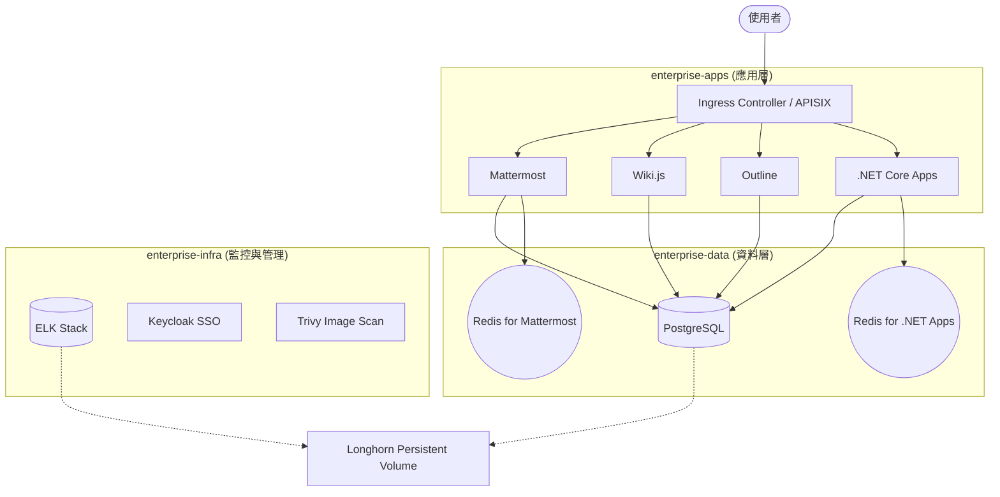
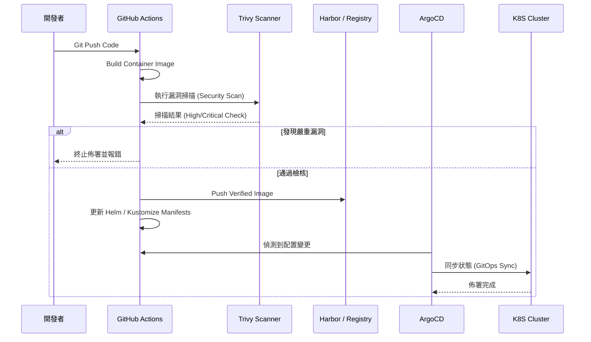

# 企業級 K8S 架構研究 (Enterprise K8S Architecture Research)

本專案旨在研究並建構一套適合企業環境的 Kubernetes (K8S) 基礎設施架構，涵蓋關鍵應用整合、自動化運維與資安防護要求。

## 1. 核心應用組件 (Application Stack)
K8S 叢集將承載以下關鍵服務：
- **協作工具**：Mattermost (通訊)、Wiki.js (知識庫)、Outline (文件)。
- **監控與日誌**：ELK Stack (Elasticsearch, Logstash, Kibana)。
- **資料庫與緩存**：PostgreSQL (關聯式資料庫)、Redis (快取與 Session 儲存)。
- **應用開發**：.NET Core 容器化服務。

## 2. 基礎設施架構要求
- **Ingress 控制**：建議使用 NGINX Ingress Controller 或 APISIX。
- **儲存管理**：Persistent Volume (PV) 管理（建議整合企業 NAS 或分散式儲存如 Longhorn/Ceph）。
- **身分驗證**：整合 Keycloak (OIDC/SAML) 以達成 SSO。

## 3. 資安與上版流程 (SecDevOps)
- **Image 掃描**：整合 Trivy 或 Harbor 進行映像檔漏洞掃描。
- **上版流程 (CI/CD)**：
    - 使用 GitHub Actions 或 GitLab CI 進行建置。
    - 採用 ArgoCD 實作 GitOps 自動化佈署。
- **網路安全**：實作 Network Policy 進行 Namespace 層級的隔離。

## 4. 系統架構圖 (Architecture Diagrams)

### 4.1 核心服務佈署架構 (Cluster Overview)
本架構採用多層 Namespace 隔離設計，並透過 Ingress Controller 統一出口。

### 4.2 SecDevOps 上版流程 (CI/CD Pipeline)
展示從代碼提交到部署的安全自動化路徑。

## 5. 研究 Issue 追蹤
詳細的技術規劃與實作進度請參考本倉庫的 [Issues](https://github.com/tedtv1007-ctrl/enterprise-k8s-architecture-research/issues)。
